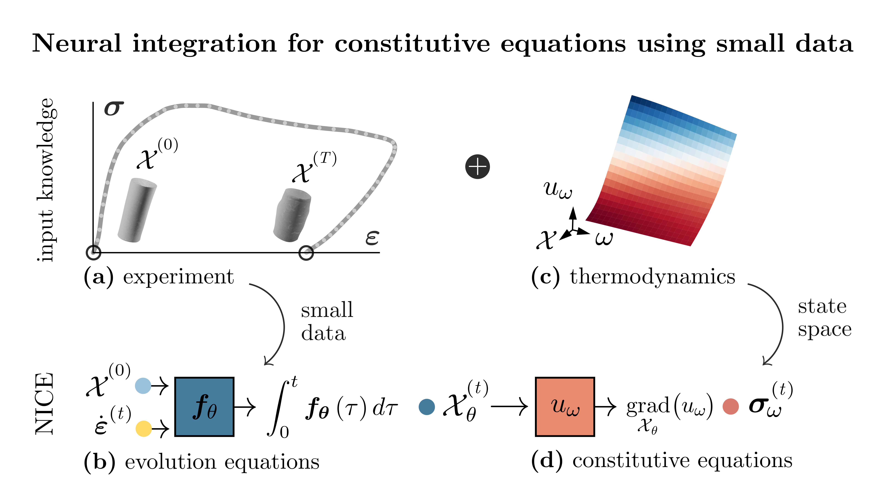

## Neural integration for constitutive equations

[](https://zenodo.org/doi/10.5281/zenodo.10360702)

This library provides the implementation in PyTorch of the **Neural Integration for Constitutive Equations (NICE)** method, see [1]. The algorithms in this repository are implemented using `torch` [2] and `torchdiffeq` [3] libraries, thus are fully supported to run on GPU.

<center></center>

## Features

The **NICE** (Neural Integration for Constitutive Equations) method is a novel deep learning tool for the automatic discovery of constitutive equations from small data - partial and incomplete material state observations. 
The approach builds upon the solution of the initial value problem describing the time evolution of the material state and leverages the framework provided by neural differentials equations [4].
NICE can learn accurate, consistent, and robust constitutive models from incomplete, sparse, and noisy data collecting simple conventional experimental protocols. 

## Basic usage

This library provides one main interface `NICE` which contains algorithms for solving the initial value problems associated with the time evolution of the material state and learn from sparse and incomplete material state observations. 

To call the method:

```
import numpy as np
import torch
from nice_module import NICE

# Initialize NICE model
nice_model = NICE(params_f, params_u, number_IC, norm_params, dim, nsvars)

# Generate sample data
t = np.linspace(0, 10, 100)
y0 = np.zeros((10, 2))  # Initial conditions
u = ... # strain protocol

# Integrate model
result, stress, d = nice_model.integrate(u, y0, t)
```

where `params_f` and `params_u` are the parameters used to construct the evolution equation and internal energy network, respectively; `number_IC` is the number of initial conditions in case of multiple loading paths tested at the same time (the method is parallelized based on tensorial calculation); `norm_params` is the list of normalization parameters; `dim` is the dimensional space (in 2D `dim=2`, in 3D `dim=3`); and `nsvars` is the number of state variables (`nsvars=1` means the method only uses the elastic strain, while if `nsvars>1` then also mass density and dissipative state variables are accounted for).

## Prerequisites

- python 3.6+
- pyTorch
- torchdiffeq


## References

[1] F Masi, I Einav (2023). "[Neural integration for constitutive equations using small data](https://doi.org/10.48550/arXiv.2311.07849)". arXiv preprint: 2311.07849.

    @article{masieinav2023,
    title={Neural integration for constitutive equations using small data},
    author={Masi, Filippo and Einav, Itai},
    journal={arXiv preprint 2311.07849},
    year={2023},
    doi={10.48550/arXiv.2311.07849}
    
[2] A Paszke, S Gross, S Chintala, G Chanan, E Yang, Z DeVito, Z Lin, A Desmaison, L Antiga, and A Lerer. Automatic differentiation in PyTorch. 2017.

[3] R TQ Chen. `torchdiffeq`, 2018. url: [https://github.com/rtqichen/torchdiffeq](https://github.com/rtqichen/torchdiffeq).

[4] R TQ Chen, Y Rubanova, J Bettencourt, and D K Duvenaud. Neural ordinary differential equations. Advances in neural information processing systems, 31, 2018. doi: 10.48550/arXiv.1806.07366.

---

If you found this library useful in your research, please consider citing.

    @article{NICE2023repo,
    title={`NICE: Neural integration for constitutive equations`},
    author={Masi, Filippo},
    year={2023},
    url={https://github.com/filippo-masi/NICE}
